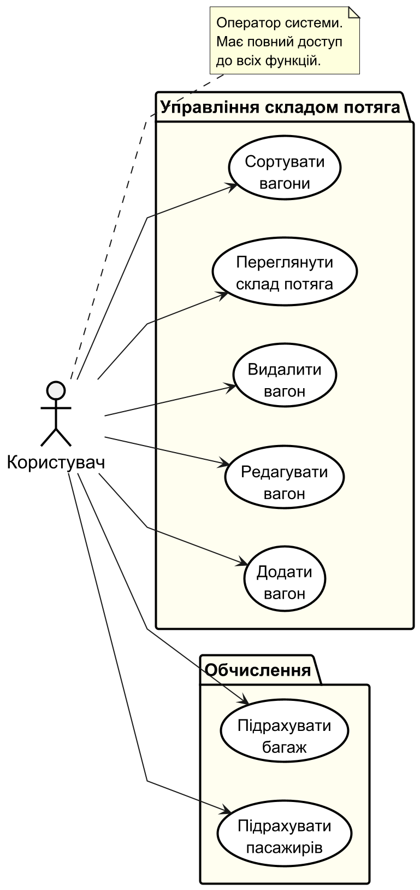
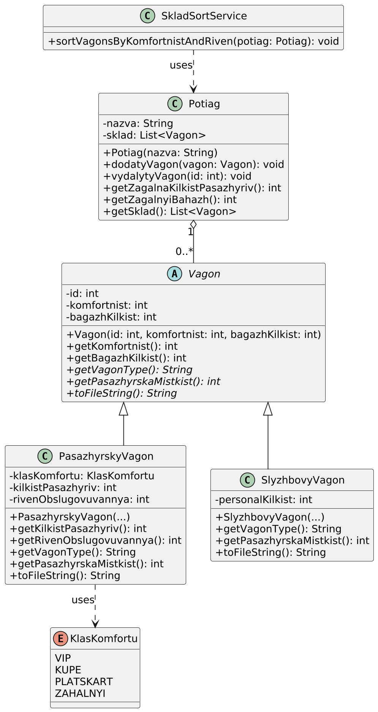

# Лабораторна робота №4: Моделювання системи

У цій роботі розроблено UML-діаграми для проектування архітектури системи "Електронний словник".

## 1. Діаграма варіантів використання (Use Case Diagram)
Відображає взаємодію користувача (User) з системою: переклад, додавання слів.

## 2. Діаграма класів (Class Diagram)
Відображає структуру класів (Dictionary, Translator, IDataSource) та їх зв'язки (Асоціація, Реалізація).

